<!--
═══════════════════════════════════════════════════════════════════════════════
  PROFILE README — "Terminal Identity"
  ────────────────────────────────────────────────────────────────────────────
  MAINTENANCE GUIDE
  Everything you need to customise this file is in docs/PLACEHOLDERS.md.
  Search this file for  thecoolersyn  to find every spot that needs your real
  GitHub handle. There are also ⟦TODO⟧ markers for optional sections.
═══════════════════════════════════════════════════════════════════════════════
-->

<!-- ══════════════════ HERO ══════════════════ -->

 

<!-- Compact introduction -->
<h3>Building software, experimenting with AI, and breaking things until they work.</h3>

  Software engineering &amp; programming · AI and developer tooling · systems &amp; automation ·
  web development · finance &amp; markets

  
  
  

 

<!-- ══════════════════ DASHBOARD ══════════════════ -->


 

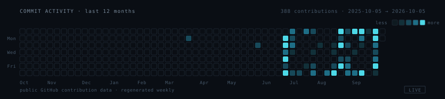

 

<!-- ══════════════════ STACK ══════════════════ -->

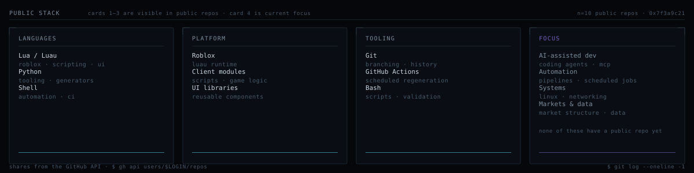

 

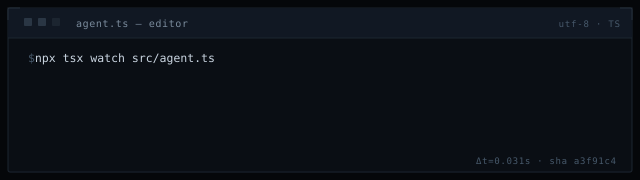

 

<!-- ══════════════════ ABOUT ══════════════════ -->

<h3>About</h3>

  Software engineering is the through-line: building things, breaking them,
  and understanding why. Everything else is a different angle on the same
  curiosity about how systems behave.

<!--
  NOTE: markdown is NOT processed inside raw HTML blocks on GitHub. This table
  must be written in pure HTML (<strong>, <ul>, <li>) — using ** or - here
  renders as literal asterisks.
-->
<table>
  <tr>
    <td valign="top" width="50%">

<strong>▸ Things I build</strong>
<ul>
<li><strong>Applications &amp; services</strong> — typed, testable, boring in the right places</li>
<li><strong>Developer tooling</strong> — CLIs, extensions, small tools that remove a repetitive step</li>
<li><strong>Git &amp; automation</strong> — branching, reviews, and the pipelines and bots that run unattended</li>
<li><strong>Web development</strong> — React, Next.js, component systems, API design</li>
<li><strong>AI-assisted workflows</strong> — coding agents, MCP tool servers, evaluation harnesses</li>
<li><strong>Luau tooling</strong> — modules and platform tooling for Roblox</li>
</ul>

    </td>
    <td valign="top" width="50%">

<strong>▸ Things I explore</strong>
<ul>
<li><strong>Systems &amp; operating systems</strong> — what actually happens underneath</li>
<li><strong>Linux, networking &amp; infrastructure</strong> — distributions, dual boot, DNS, TCP, services</li>
<li><strong>Reverse engineering</strong> — reading binaries and protocols to see how they work</li>
<li><strong>Markets &amp; financial technology</strong> — market structure, data, quantitative thinking</li>
<li><strong>Open source ecosystems</strong> — reading code, packaging, and how projects are maintained</li>
</ul>

    </td>
  </tr>
</table>

  Outside the code: badminton, and an unreasonable amount of time in terminals.

 

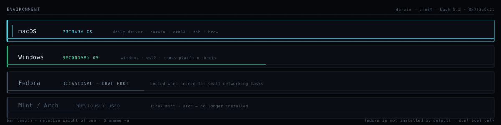

 

<!-- ══════════════════ CODE × MARKETS ══════════════════ -->

<h3>Code &times; Markets</h3>

  Where engineering meets market structure — <code>systematic thinking</code> applied to
  price, volume and risk. Interested in the mechanics of markets and the software that
  models them, not in pretending to have beaten them.

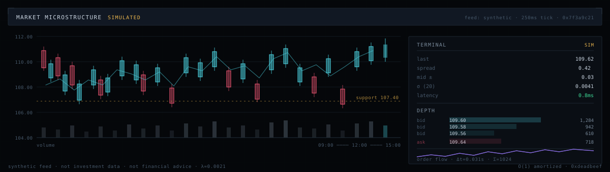

 

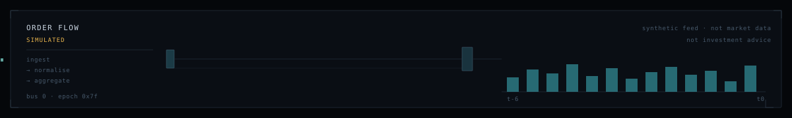

  
    Simulated feed. Nothing here is market data, investment advice, or a performance claim.
  

 

<!-- ══════════════════ PROJECTS ══════════════════ -->

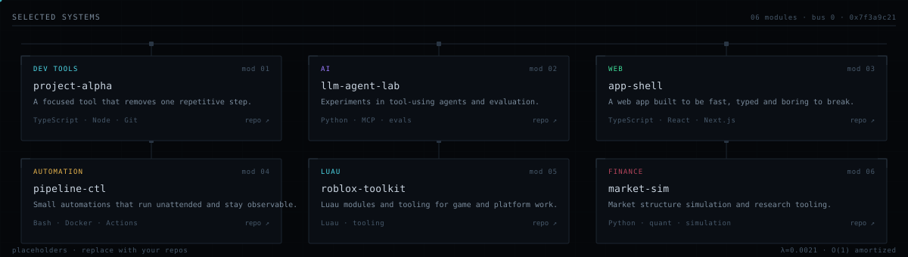

<!--
  ────────────────────────────────────────────────────────────────────────────
  REPLACING THE PROJECTS PANEL
  The SVG above is a diagram-style panel. To use real, clickable repos instead,
  replace that  with the markdown table in docs/PLACEHOLDERS.md and point the
  links at your repositories. Both options are documented there.
  ────────────────────────────────────────────────────────────────────────────
-->

 

<!-- ══════════════════ SYSTEMS ══════════════════ -->

<h3>Systems &amp; Runtime</h3>

  Most of what I build ends up behind an interface of some kind. Orchestration,
  tool calls, retrieval, queues — the unglamorous layer that decides whether the
  clever part actually works.

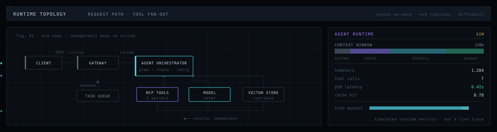

 


  
    Illustrative architecture and simulated runtime metrics — not a live trace.
  

 

<!-- ══════════════════ STATS ══════════════════ -->

<!--
  Two ways to get real stats. Pick ONE.
  ─────────────────────────────────────────────
  A) RELIABLE (recommended) — static SVGs regenerated by GitHub Actions.
     Uses .github/workflows/stats.yml in this repo. No third-party uptime
     dependency, no rate limits. Cards live at assets/stats/live/.

  B) ZERO-CONFIG — the Vercel endpoints below render on request.
     Simpler, but depends on a third-party service staying up and un-rate-limited.
     docs/PLACEHOLDERS.md explains how to switch between them.
-->
<a href="https://github.com/thecoolersyn">
  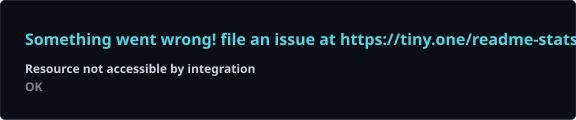
</a>
<a href="https://github.com/thecoolersyn">
  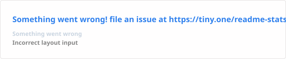
</a>

 

<!--
  Contribution streak. This is the ONE live third-party service left in the
  README — if it is down it renders an error card, so it is kept to a single
  badge and the rest of the page depends on nothing but committed SVGs.
  Delete this whole <a> block if you would rather have zero external calls.
-->

 

<!--
  If the live-generated cards above are not set up yet, comment this block out and
  use the zero-config endpoints instead (see docs/PLACEHOLDERS.md):

-->

  
    The contribution graph above is a simulated pattern. The two cards here are generated from
    real public GitHub data by a scheduled workflow in this repo. Everything on this page is
    read-only — nothing here is financial or performance advice.
  

 

<!-- ══════════════════ CONNECT ══════════════════ -->

  
  <!--
    Add or remove links below. Delete the whole <a> block for a channel you do not use.
    ⟦TODO⟧: replace your handles and drop the ones you do not want.
  -->
  
  
  <!-- ⟦TODO⟧: personal site, if you have one -->

 

<!-- ══════════════════ FOOTER ══════════════════ -->

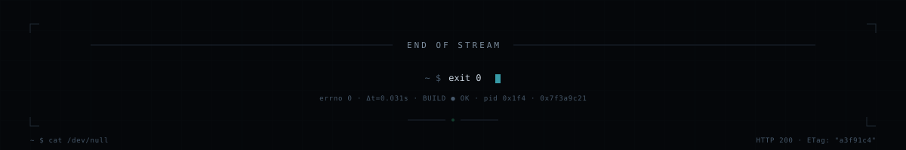

<!--
═══════════════════════════════════════════════════════════════════════════════
  GOTCHAS WORTH KNOWING
  • GitHub strips <script>, <foreignObject> and inline event handlers. All
    animation here is SMIL inside standalone .svg files, which GitHub serves
    as images — that is why it works and inline SVG/HTML does not.
  • All image paths are relative, so this repo must be the public
    thecoolersyn/thecoolersyn repository (the "special" profile repo).
  • See docs/ASSETS.md to edit assets and docs/PLACEHOLDERS.md for the
    full replacement checklist.
═══════════════════════════════════════════════════════════════════════════════
-->
